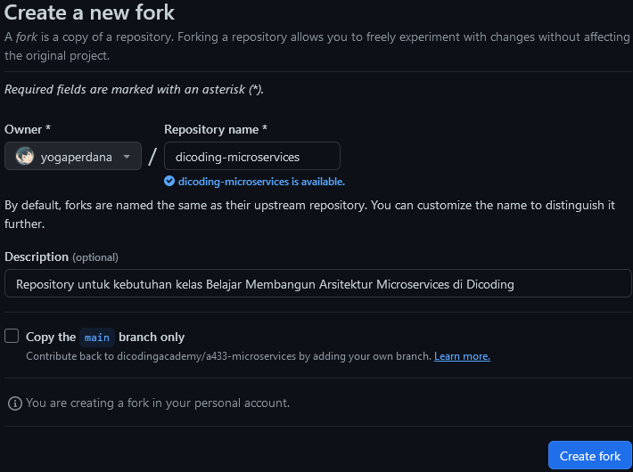
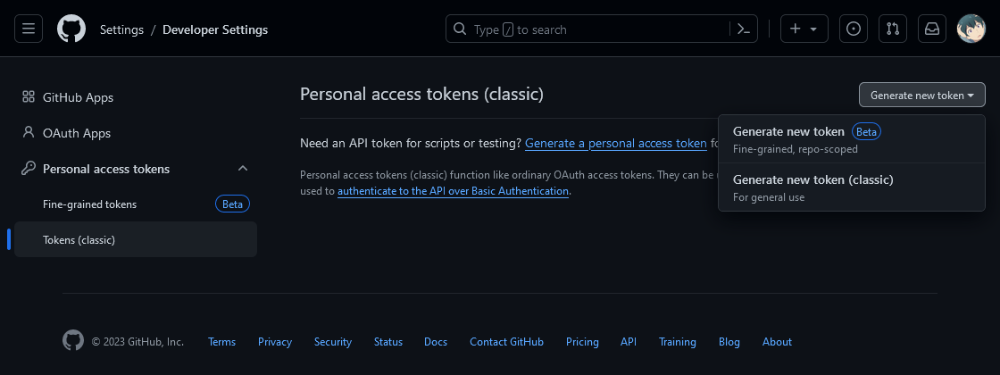
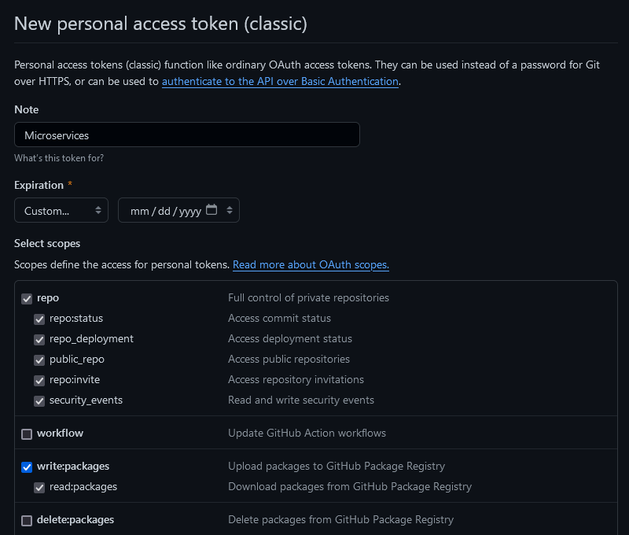
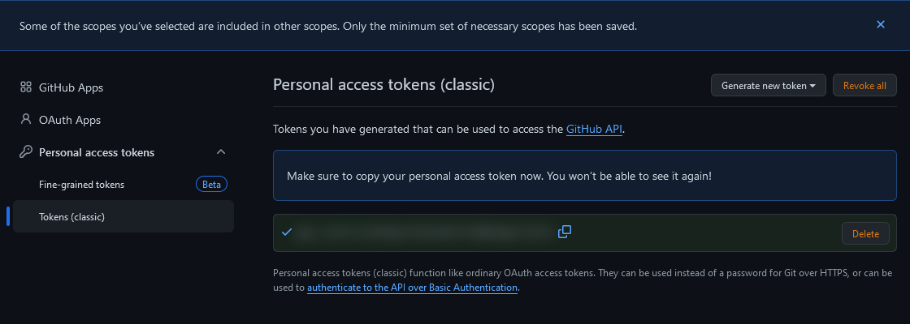
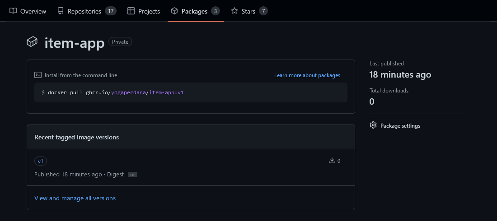
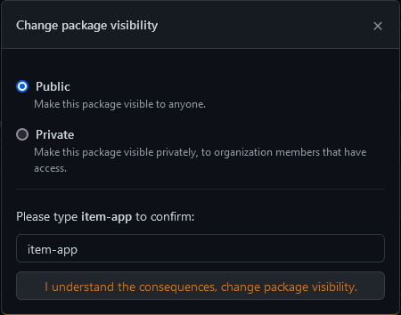
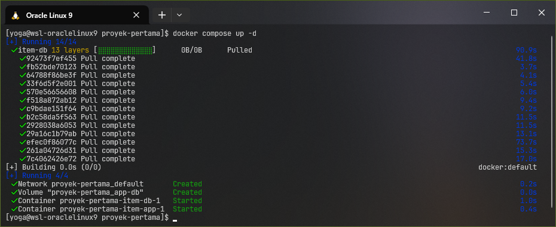
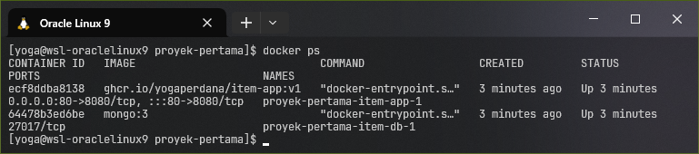
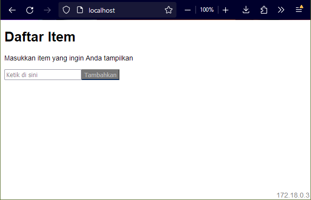
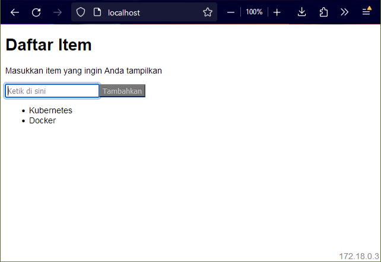

# Proyek Pertama: Deploy Aplikasi Item App dengan Docker Compose

Repository ini digunakan untuk kebutuhan dan submisi proyek tugas pada kelas [Belajar Membangun Arsitektur Microservices](https://www.dicoding.com/academies/433) di platform [Dicoding Academy](https://dicoding.com).

Dikerjakan oleh [Yoga Perdana Putra](https://github.com/yogaperdana).

## Pengantar

Pada dasarnya, _starter project_ ini adalah aplikasi web sederhana yang memungkinkan pengguna untuk memasukkan _item_ (teks), menyimpannya ke _database_, dan menampilkannya saat itu juga.

Aplikasi ini terdiri dari 2 bagian:
- **item-app**: Bertugas untuk menerima dan mengolah _request_ terkait _static asset_ seperti berkas HTML, CSS, dan JavaScript. Bagian ini menggunakan Node.js dan Express.
- **item-db**: Bertugas untuk menerima dan mengolah pembacaan dan penulisan data dari/ke _database_. Bagian ini menggunakan MongoDB.

## Kriteria

1. Menggunakan _source code_ dari _starter project_ yang telah disiapkan:
   - _Fork_ [repository starter project](https://github.com/dicodingacademy/a433-microservices/tree/proyek-pertama)
   - _Clone_ spesifik untuk _branch_ `proyek-pertama`.
2. Membuat berkas Dockerfile di _root project_:
   - Menggunakan _base image_ Node.js versi 14.
   - Menentukan bahwa _working directory_ untuk _container_ adalah `/app`.
   - Menyalin seluruh _source code_ ke _working directory_ di _container_.
   - Menentukan agar aplikasi berjalan dalam _production mode_ dan menggunakan _container_ bernama `item-db` sebagai _database host_.
   - Menginstal _dependencies_ untuk _production_ dan kemudian _build_ aplikasi.
   - Ekspos bahwa _port_ yang digunakan oleh aplikasi adalah `8080`.
   - Saat _container_ diluncurkan, jalankan server dengan perintah `npm start`.
3. Membuat _script_ untuk _build_ dan _push_ Docker image:
   - Membuat berkas _shell script_ bernama `build_push_image.sh`.
   - Perintah untuk membuat Docker image dari Dockerfile yang tadi dibuat, dengan nama _image_ `item-app`, dan memiliki _tag_ `v1`.
   - Melihat daftar _image_ di lokal.
   - Mengubah nama _image_ agar sesuai dengan format GitHub Packages.
   - _Login_ ke GitHub Packages via Terminal.
   - Mengunggah _image_ ke GitHub Packages.
4. Menggunakan **Docker Compose**:
   - Membuat berkas `docker-compose.yml`.
   - Menggunakan Docker Compose versi 2 atau lebih.
   - Memiliki dua buah service: `item-app` dan `item-db`.<br>
     1. `item-app`
        - Menggunakan _image_ `item-app` dari GitHub Packages.
        - Melakukan _port mapping_ agar dapat diakses dari _port_ 80 di _host_.
        - Pastikan `item-app` hanya berjalan setelah `item-db` diluncurkan.
     2. `item-db`
        - Menggunakan _image_ `mongo:3` dari Docker Hub.
        - Memakai _volume_ bernama `app-db` dengan target `/data/db` di _container_.
   - Memiliki satu buah _volume_ bernama `app-db`.
   - Menerapkan _restart policy_ agar _container_ selalu _restart_ ketika terhenti.
   - Menyertakan berkas `log.txt` yang berisi _logs_ ketika menggunakan Docker Compose.

## Lingkungan Kerja dan Kebutuhan

> Proyek ini dikerjakan menggunakan sistem operasi berbasis Linux (Terminal/non-GUI) yang terpasang pada Windows 10 melalui fitur Windows Subsystem for Linux (WSL). Namun pada dasarnya dapat dikerjakan melalui sistem operasi Windows, Linux maupun MacOS, sehingga proses instalasi _tools_ dapat menyesuaikan.

Pastikan sistem telah terpasang aplikasi-aplikasi berikut:
1. [Git](https://git-scm.com/)
2. [Docker](https://docs.docker.com/get-docker/)
3. [Docker Compose](https://docs.docker.com/compose/) (otomatis tersedia jika menggunakan [Docker Desktop](https://docs.docker.com/desktop/))

## Langkah Pengerjaan & Penggunaan

### Fork & Clone Repository

1. Untuk melakukan _forking_ repositori, buka halaman [_starter repository_](https://github.com/dicodingacademy/a433-microservices/) melalui _browser_, lalu klik tombol [`Fork`](https://github.com/dicodingacademy/a433-microservices/fork) yang ada di bagian atas.
   <details>
      <summary>🖼️ Tampilkan gambar</summary>

      
   </details>
2. Pastikan untuk **tidak** mencentang opsi "Copy the `main` branch only" karena seluruh _branch_ akan digunakan untuk seluruh proyek. Kemudian tekan tombol `Create Fork`.
3. Kini terdapat repositori baru di akun Github milik sendiri yang berisi hasil _fork_ dari _starter_. Tekan tombol `<> Code` lalu salin terlebih dahulu URL HTTPS yang ada untuk melakukan _clone_. Perhatikan pada akhir URL terdapat tambahan `.git`.
4. Buka terminal di komputer lokal. Masuk terlebih dahulu pada direktori yang akan digunakan untuk mengerjakan proyek.
5. _Clone branch_ **proyek-pertama** dari repositori hasil _fork_ sebelumnya dengan menggunakan perintah berikut ini.
   ```sh
   git clone <URL forked repo> -b proyek-pertama proyek-pertama
   ```
6. Masuk ke direktori `proyek-pertama` yang berisi berkas-berkas _clone_ dari repositori untuk mengerjakan proses selanjutnya sebagai _working directory_.
   ```sh
   cd proyek-pertama
   ```

### Membuat GitHub Personal Access Tokens

Sebelum mengunggah _image_ aplikasi ke GitHub Container Registry (GitHub Packages), diperlukan sebuah _personal access tokens_ sebagai token autentikasi ke akun GitHub. Kode token yang dihasilkan dapat digunakan kembali untuk proyek berikutnya.

1. Masuk ke halaman [Personal access tokens (classic)](https://github.com/settings/tokens) pada akun GitHub, lalu pilih `Generate new token -> Generate new token (classic)`.
   <details>
      <summary>🖼️ Tampilkan gambar</summary>
      
      
   </details>
2. Beri nama token pada isian "_note_" misalnya `microservices`. Kemudian tentukan waktu kadaluwarsa token, misalnya 30 hari. Berikutnya pada pilihan "_select scopes_", centang pada `write:packages`. Perhatikan juga bahwa pilihan _scope_ `repo` di atasnya juga akan ikut tercentang. _Scroll_ ke bawah lalu tekan "_generate token_".
   <details>
      <summary>🖼️ Tampilkan gambar</summary>
      
      
   </details>
3. Salin kode token yang telah dibuat, lalu simpan sementara di tempat yang aman. Jangan ekspos kode token tersebut kepada siapapun karena bersifat rahasia.
   <details>
      <summary>🖼️ Tampilkan gambar</summary>
      
      
   </details>

### Build & Push Image

> Pada berkas-berkas seperti [`Dockerfile`](Dockerfile), [`build_push_image.sh`](build_push_image.sh) dan [`docker-compose.yml`](docker-compose.yml), telah terdapat baris komentar yang menjelaskan kode/perintahnya.

1. _Container image_ Docker dibuat dengan berkas [`Dockerfile`](Dockerfile) sesuai dengan kriteria proyek.
2. Berkas _shell script_ [`build_push_image.sh`](build_push_image.sh) berisi perintah untuk _build_ dan _push image_ ke GitHub Container Registry. Perhatikan pada variabel `github_account`, <u>sesuaikan terlebih dahulu dengan nama akun GitHub yang digunakan</u>.
3. Pastikan untuk memberikan _permission_ pada berkas tersebut agar dapat dieksekusi:
   ```sh
   chmod +x build_push_image.sh
   ```
4. Jalankan _shell script_ tersebut untuk mengekseksusi perintahnya.
   ```sh
   bash build_push_image.sh
   ```
5. Saat diminta _password_ untuk Login ke GitHub Container Registry, masukkan **kode token** yang sebelumnya telah dibuat. **Bukan _password_ akun GitHub**. Jika menggunakan Terminal, dapat menggunakan klik kanan _mouse_ untuk _paste_. Lalu tekan _enter_ untuk melanjutkan.
6. Periksa _package_ yang telah diunggah tadi dengan mengakses alamat URL _shortlink_ sesuai nama _image_ yang telah diformat melalui _browser_ yaitu [https://ghcr.io/yogaperdana/item-app](https://ghcr.io/yogaperdana/item-app) (sesuaikan dengan nama akun yang digunakan).
   <details>
      <summary>🖼️ Tampilkan gambar</summary>
      
      
   </details>
7. Mengatur _package_ agar dapat diakses secara publik:
   1. Klik teks `⚙️ Package settings` yang terdapat di sebelah kanan halaman.
   2. _Scroll_ ke bawah pada bagian "_Danger Zone_".
   3. Klik "_Change visibility_" dan pilih "_Public_".
   4. Konfirmasi dengan mengetik nama _image_ yaitu `item-app` agar tombol yang bertuliskan "_I understand the consequent, change package visibility_" dapat di-klik.
      <details>
         <summary>🖼️ Tampilkan gambar</summary>
         
         
      </details>

### Deploy Aplikasi dengan Docker Compose

1. _Deployment_ aplikasi dilakukan dengan membuat berkas [`docker-compose.yml`](docker-compose.yml) sesuai dengan kriteria proyek. Perhatikan untuk _image_ yang digunakan harus sesuai dengan nama _image_ yang telah diunggah sebelumnya ke GitHub Container Registry.
2. Jalankan _container_ dengan perintah berikut.
   ```sh
   docker compose up -d
   ```
   <details>
      <summary>🖼️ Tampilkan gambar</summary>
      
      
   </details>
3. Periksa bahwa terdapat 2 (dua) _containers_ baru yang berjalan melalui Docker.
   ```sh
   docker ps
   ```
   <details>
      <summary>🖼️ Tampilkan gambar</summary>
      
      
   </details>
4. Dapatkan _logs_ hasil eksekusi Docker Compose dengan perintah berikut.
   ```sh
   docker compose logs > log.txt
   ```
5. Akses aplikasi dengan _browser_ melalui alamat URL [localhost](http://localhost).
   <details>
      <summary>🖼️ Tampilkan gambar</summary>
      
      
   </details>
6. Untuk memeriksa bahwa koneksi ke _database_ MongoDB bekerja, tambahkan beberapa entri item baru. Item yang telah ditambahkan seharusnya akan tampil pada daftar dibawahnya.
   <details>
      <summary>🖼️ Tampilkan gambar</summary>
      
      
   </details>

## Pembersihan

1. Untuk menghentikan _containers_ yang berjalan di Docker, eksekusi perintah berikut di Terminal:
   ```sh
   docker compose down
   ```
2. Untuk menghapus _images_ yang telah dibuat di Docker, eksekusi perintah berikut di Terminal:
   ```sh
   docker rmi -f $(docker images -q item-app)
   docker rmi -f $(docker images -q mongo:3)
   ```
